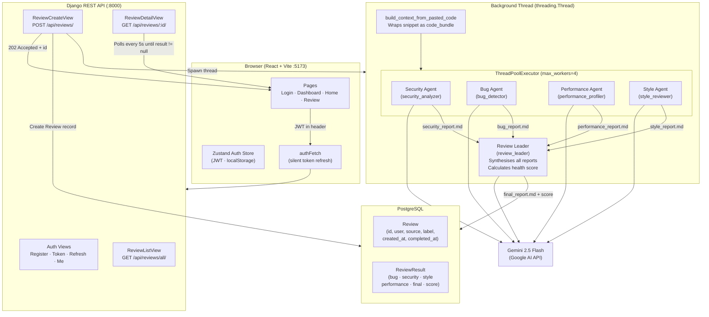

# Architecture

## Overview

Multigent is a multi-agent AI code review platform. A user pastes a code snippet; five specialised AI agents analyse it concurrently; a sixth synthesises the findings into a unified report with an overall health score.

---

## System Diagram



---

## Request Lifecycle

```
Browser                     Django API                Background Thread           Gemini API
   │                             │                           │                        │
   │  POST /api/reviews/         │                           │                        │
   │  { code: "..." }            │                           │                        │
   │────────────────────────────►│                           │                        │
   │                             │ Create Review (DB)        │                        │
   │                             │ Spawn thread ─────────────►                        │
   │  202 Accepted { id: 7 }     │                           │                        │
   │◄────────────────────────────│                           │                        │
   │                             │                    Build context bundle            │
   │                             │                    ThreadPoolExecutor.submit ×4    │
   │                             │                           │── Security ───────────►│
   │                             │                           │── Bug ────────────────►│
   │                             │                           │── Performance ─────────►│
   │                             │                           │── Style ───────────────►│
   │                             │                           │◄── reports (concurrent)─│
   │                             │                    Review Leader ─────────────────►│
   │                             │                           │◄── final_report.md ────│
   │                             │                    Save ReviewResult (DB)          │
   │                             │                           │                        │
   │  GET /api/reviews/7/        │                           │                        │
   │  (polling every 5s)         │                           │                        │
   │────────────────────────────►│                           │                        │
   │  { result: { ... } }        │                           │                        │
   │◄────────────────────────────│                           │                        │
```

---

## Concurrency Design

### Why threading for agent execution

LLM API calls are **I/O-bound** — each agent spends the vast majority of its time waiting for a network response from the Gemini API. Python's GIL (Global Interpreter Lock) only blocks on CPU-bound work; threads release the GIL during I/O, so multiple agents can wait for their API responses simultaneously without contention.

Two layers of threading are used:

**Layer 1 — Django view thread (`threading.Thread`)**

`ReviewCreateView.post()` spawns a single daemon thread to run the entire crew pipeline. This allows the HTTP response (`202 Accepted`) to return to the client immediately, before any agent has run. Without this, the request would time out — Gemini calls for five agents can take several minutes.

```python
# views.py
thread = threading.Thread(
    target=_run_crew_sync,
    args=(review.id, bundle),
    daemon=True,          # exits if the main process exits
)
thread.start()
return Response({'id': review.id}, status=202)
```

**Layer 2 — Agent pool (`ThreadPoolExecutor`)**

Inside the crew, the four specialist agents (security, bug, performance, style) are submitted to a `ThreadPoolExecutor` with `max_workers=4`. All four fire concurrently and `f.result()` blocks until each completes. Only then does the Review Leader run sequentially, as it depends on all four reports being written to disk first.

```python
# crew.py
with ThreadPoolExecutor(max_workers=4) as executor:
    futures = [
        executor.submit(self._run_crew, self.security_analyzer(), ...),
        executor.submit(self._run_crew, self.bug_detector(), ...),
        executor.submit(self._run_crew, self.performance_profiler(), ...),
        executor.submit(self._run_crew, self.style_reviewer(), ...),
    ]
    for f in futures:
        f.result()          # wait for all four

self._run_crew(self.review_leader(), ...)   # synthesise
```

This reduces total agent wall-clock time from ~4× sequential to ~1× concurrent (bounded by the slowest individual agent).

### Why multiprocessing for parsing (architectural intent)

The context builder (`agents_ai/github/`) is designed with CPU-bound parsing in mind: AST traversal, static analysis (complexity scoring, lint), and file tree construction are all CPU-intensive. These tasks **do not** benefit from threading because the GIL prevents true parallelism for CPU-bound work.

The intended model is:

```
build_context_from_repo(url)
    │
    ├── Process 1: File tree scanner      (os.walk, language detection)
    ├── Process 2: AST parser             (ast module, imports/functions/classes)
    ├── Process 3: Static analyser        (radon complexity, flake8 lint)
    └── Process 4: Metadata reader        (README, requirements.txt, .env.example)
```

Each process runs in a separate interpreter with no GIL contention. Results are merged into a single `code_bundle` dict and passed to the crew.

The current implementation (`build_context_from_pasted_code`) is a deliberate simplification — the user controls scope by pasting directly — while the multiprocessing parser is reserved for the future file-upload and repository-reading paths.

---

## Context Builder & Token Budget

### Current approach — pasted code

The active path is intentionally minimal:

```python
# agents_ai/github/context_builder.py
def build_context_from_pasted_code(pasted_code: str) -> dict:
    return {
        "code_bundle": pasted_code,
        "files_included": [],
    }
```

The raw pasted text is passed directly to each agent as `{code_bundle}` in their task prompts. The user is responsible for scoping what they submit.

### Why the GitHub URL approach was not used

An earlier design accepted a GitHub repository URL, cloned the repo server-side, and built a structured context bundle from the full codebase. This was abandoned for two reasons:

**1. Token budget.** A typical repository contains hundreds of files, many irrelevant to a code review (assets, migrations, lock files, generated code). Feeding a full clone to five agents would routinely exceed the context window of any LLM, causing truncation, poor analysis quality, or outright API failures. There is no reliable way to automatically determine which files matter without first understanding the codebase — a chicken-and-egg problem.

**2. Operational complexity.** Cloning repos server-side requires temporary disk space, authenticated GitHub API access for private repos, cleanup logic, and significant latency before any agent can begin. This adds infrastructure burden disproportionate to the benefit given the token ceiling.

### Token budget rationale

Gemini 2.5 Flash has a context window of approximately 1 million tokens, but in practice:

- Each agent receives the full `code_bundle` in its task prompt plus its role/goal backstory
- Five agents run concurrently, each making independent API calls
- The Review Leader receives its own summarisation prompt
- Prompt overhead (role, task description, expected output format) consumes roughly 500–800 tokens per agent before any code is included

The practical safe limit for `code_bundle` is therefore **around 50,000–100,000 tokens** (~40,000–80,000 words of code) to leave headroom for the agents' own reasoning and output. Beyond this, analysis quality degrades as the model begins to skip or skim sections.

Pasted code naturally enforces this limit — users paste what they want reviewed, not entire repositories. A future file-upload path would apply explicit truncation rules (defined in `codebase_reader_rules.toml`) to enforce the budget automatically.

---

## API Endpoints

| Method | Endpoint | Auth | Description |
|---|---|---|---|
| `POST` | `/api/auth/register/` | None | Create a new user account |
| `POST` | `/api/auth/token/` | None | Obtain JWT access + refresh tokens |
| `POST` | `/api/auth/refresh/` | None | Refresh an expired access token |
| `GET` | `/api/auth/me/` | JWT | Return current user details |
| `POST` | `/api/reviews/` | JWT | Submit code for review (returns 202) |
| `GET` | `/api/reviews/all/` | JWT | List all reviews for the current user |
| `GET` | `/api/reviews/<id>/` | JWT | Retrieve a specific review and its result |
| `DELETE` | `/api/reviews/<id>/delete/` | JWT | Delete a specific review |

Full interactive docs: `http://localhost:8000/api/docs/`

---

## Health Score Formula

The Review Leader calculates an overall health score (0–100) using the following weighted deductions:

| Issue type | Deduction per instance | Maximum deduction |
|---|---|---|
| Logic / runtime bugs | −5 | −20 |
| Security vulnerabilities | −10 | −25 |
| Performance bottlenecks | −3 | −15 |
| Style violations | −1 | −10 |
| Technical debt (TODOs) | −0.5 | −10 |
| Known CVEs | −5 | −20 |

A score of 100 means no issues were detected across all five agents. The score is extracted from the final report via regex and stored on `ReviewResult.overall_score`.

---

## Data Models

```
User (Django built-in)
 └── Review
       ├── id
       ├── user          FK → User
       ├── source        "pasted_code" | "uploaded_files"
       ├── label         "snippet" | "filename"
       ├── score         (reserved, not yet used)
       ├── created_at
       ├── completed_at  null until crew finishes
       └── ReviewResult (OneToOne)
             ├── bug_report          TextField (markdown)
             ├── security_report     TextField (markdown)
             ├── style_report        TextField (markdown)
             ├── performance_report  TextField (markdown)
             ├── final_report        TextField (markdown)
             └── overall_score       IntegerField
```

---

## Infrastructure

| Service | Image | Port | Purpose |
|---|---|---|---|
| `db` | `postgres:18-alpine` | 5432 | Primary datastore |
| `adminer` | `adminer:latest` | 8080 | Database admin UI |
| `backend` | Custom (Dockerfile) | 8000 | Django + Gunicorn |
| `frontend` | Custom (Dockerfile) | 5173 | Vite dev server |

Production uses `compose.prod.yaml` which adds an nginx reverse proxy, disables the Vite dev server, and serves the built frontend as static files.